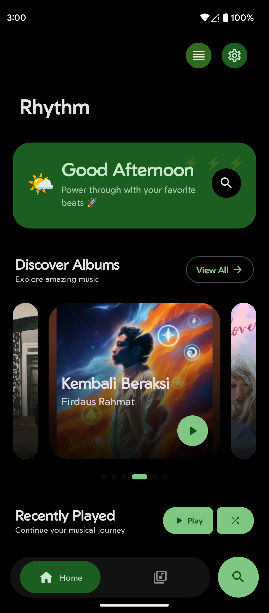
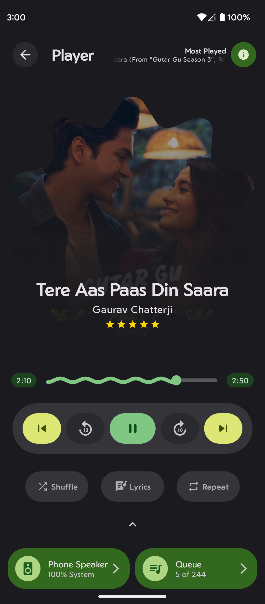
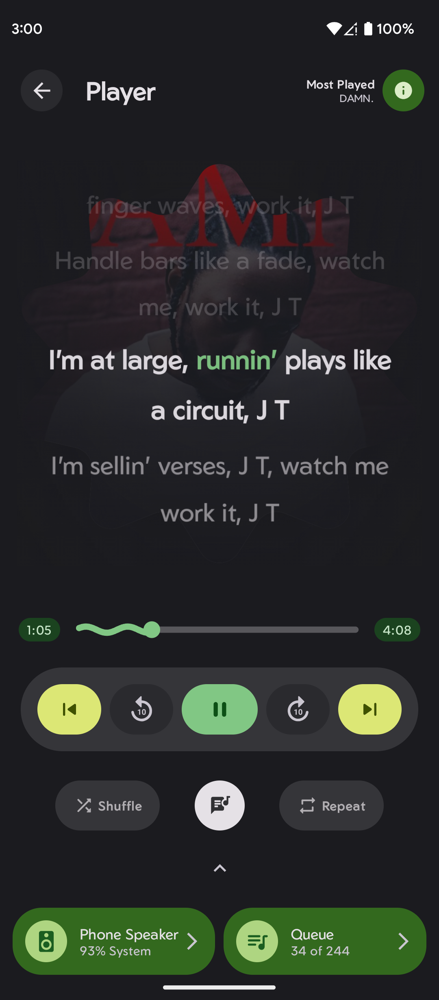
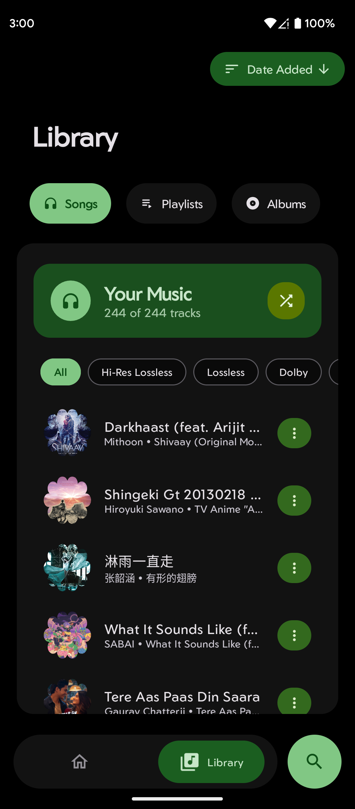
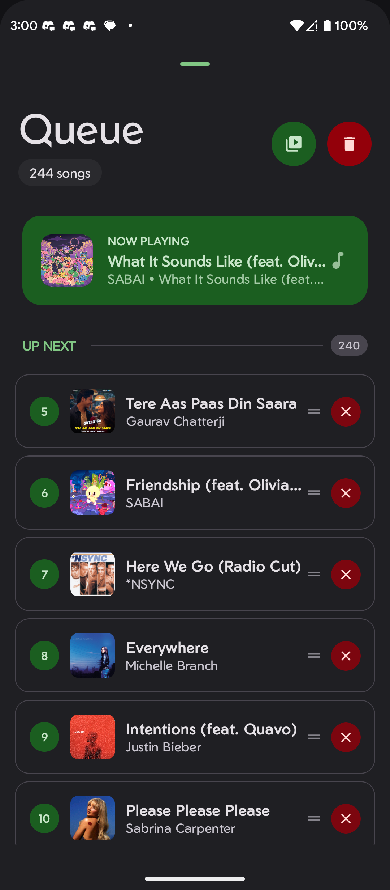
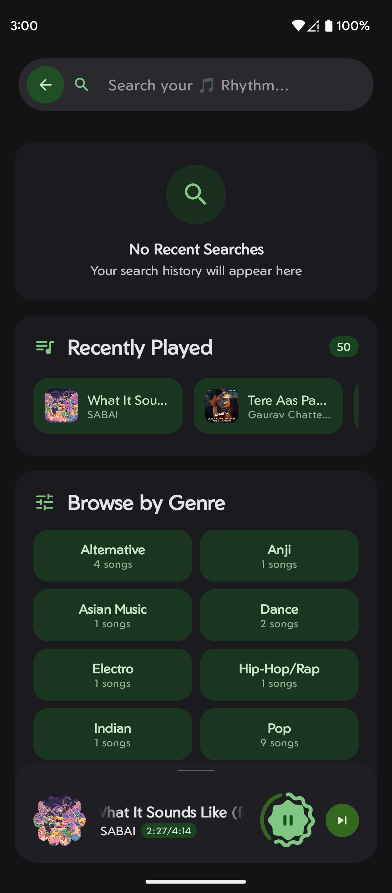
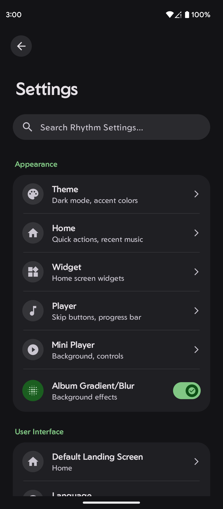
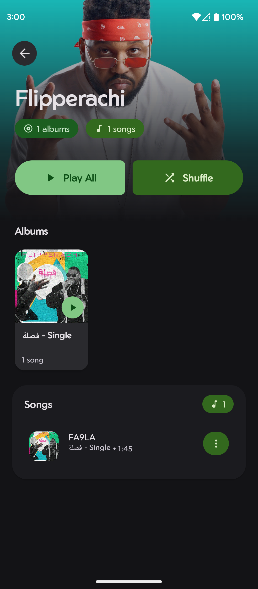

<picture>
  <source media="(prefers-color-scheme: dark)" srcset="assets/icon.png">
  <source media="(prefers-color-scheme: light)" srcset="assets/icon.png">
  
</picture>

### **Project Rhythm**

*Your Music, Your Rhythm*

---

---

### 🌐 [Website](https://rhythmweb.vercel.app/) | 📥 [Download](https://github.com/cromaguy/Rhythm/releases/latest) | 💬 [Telegram](https://t.me/RhythmSupport) | 📖 [Wiki](https://github.com/cromaguy/Rhythm/wiki)

---

## 🎵 About Rhythm

Rhythm is a modern, open-source music player for Android built with **Material 3 Expressive** design and powered by Media3 ExoPlayer 1.9.2. Now at **v4.2**, Rhythm delivers professional-grade audio with Bit Perfect playback, EAC3-JOC/Dolby Atmos via FFmpeg, a refined expressive UI, multi-select batch library actions, and complete privacy.

### ✨ Key Features

- 🎨 **Material You** - Dynamic theming with wallpaper colors (Android 12+)
- 🎵 **Professional Audio** - Media3 ExoPlayer with gapless playback, Bit Perfect mode & EAC3-JOC support
- 🎤 **Synced Lyrics** - LRCLib integration with word-by-word highlighting
- 🎛️ **10-Band EQ** - Professional equalizer with 6032+ AutoEQ device presets
- 📊 **Playback Stats** - Comprehensive listening statistics and insights
- 📱 **Modern Widgets** - Multiple responsive layouts with Material 3 design
- 🎯 **Format Support** - FLAC, ALAC, MP3, AAC, EAC3-JOC, Opus, WAV, OGG, and more
- 📂 **Multi-Select** - Batch operations across songs, albums, and playlists
- 🔮 **Expressive UI** - Refined adaptive shapes, components & Material 3 Expressive design
- 🔒 **Privacy First** - 100% FOSS, no tracking, offline-capable

**System Requirements:** Android 8.0+ (API 26) • 2GB RAM • 50MB Storage

---

## 📱 Screenshots

<table>
<tr>
<td align="center" width="25%">

 <b>🏠 Smart Home</b>
</td>
<td align="center" width="25%">

 <b>▶️ Beautiful Player</b>
</td>
<td align="center" width="25%">

 <b>🎤 Synced Lyrics</b>
</td>
<td align="center" width="25%">

 <b>📚 Rich Library</b>
</td>
</tr>
<tr>
<td align="center">

 <b>📋 Smart Queue</b>
</td>
<td align="center">

 <b>🔍 Instant Search</b>
</td>
<td align="center">

 <b>⚙️ Deep Settings</b>
</td>
<td align="center">

 <b>🎤 Artist Pages</b>
</td>
</tr>
</table>

---

## � Download & Install

### Installation Options

- **[F-Droid](https://f-droid.org/packages/chromahub.rhythm.app)** - Official F-Droid repository (full features)
- **[IzzyOnDroid](https://apt.izzysoft.de/fdroid/index/apk/chromahub.rhythm.app)** - F-Droid repository for privacy-focused users (full features)
- **[GitHub Releases](https://github.com/cromaguy/Rhythm/releases/latest)** - Direct APK download (full features)
- **[Obtainium](https://apps.obtainium.imranr.dev/redirect?r=obtainium://add/https://github.com/cromaguy/Rhythm/)** - Auto-updates from GitHub (full features)
- **Google Play Store** - *Coming soon!* (policy-compliant version)

> **Note:** F-Droid, IzzyOnDroid, and GitHub releases include all features including Deezer & YouTube Music artwork, LRCLib lyrics, and YouTube Music search. See [Build Variants](docs/BUILD_VARIANTS.md) for details.

📖 **Detailed installation guide:** See the [Installation Wiki](https://github.com/cromaguy/Rhythm/wiki/Installation-Guide)

---

## � Documentation

Complete documentation is available in our [**Wiki**](https://github.com/cromaguy/Rhythm/wiki):

- **[Getting Started](https://github.com/cromaguy/Rhythm/wiki/Getting-Started)** - First-time setup and basic usage
- **[Installation Guide](https://github.com/cromaguy/Rhythm/wiki/Installation-Guide)** - Detailed installation instructions
- **[Audio Formats](https://github.com/cromaguy/Rhythm/wiki/Audio-Formats)** - Supported formats and conversion guide
- **[Permissions Guide](https://github.com/cromaguy/Rhythm/wiki/Permissions)** - Understanding app permissions
- **[Troubleshooting](https://github.com/cromaguy/Rhythm/wiki/Troubleshooting)** - Common issues and solutions

---

## 🛠 Technology Stack

| Category | Technology |
|:---|:---|
| **UI Framework** | Jetpack Compose + Material 3 + Glance Widgets |
| **Audio Engine** | Media3 ExoPlayer 1.9.2 + FFmpeg Decoder + Bit Perfect |
| **Build System** | AGP 8.13.2 + Kotlin 2.3.10 |
| **Database** | Room + SQLite |
| **Networking** | Retrofit + OkHttp + Ktor |
| **Image Processing** | Coil + AndroidX Palette |
| **Audio Metadata** | JAudioTagger |
| **Async Programming** | Kotlin Coroutines + Flow |
| **Work Management** | WorkManager |
| **Permissions** | Accompanist Permissions |
| **Navigation** | AndroidX Navigation |
| **JSON Processing** | Gson |
| **Memory Management** | LeakCanary (debug) + Desugar JDK Libs |
| **Typography** | Geom Font + Material Icons Extended |
| **Language** | 100% Kotlin |
| **Architecture** | MVVM + Clean Architecture |

📖 **Full tech stack:** See [Technology Stack](https://github.com/cromaguy/Rhythm/wiki/Technology-Stack) in the wiki

---

## 🤝 Contributing

We welcome contributions! See [CONTRIBUTING.md](https://github.com/cromaguy/Rhythm/blob/main/docs/CONTRIBUTING.md) for guidelines.

**Quick ways to contribute:**
- 🐛 [Report bugs](https://github.com/cromaguy/Rhythm/issues)
- 💡 [Request features](https://github.com/cromaguy/Rhythm/issues)
- 👨‍💻 [Submit pull requests](https://github.com/cromaguy/Rhythm/pulls)
- 🌍 Help translate the app
- 💬 Join [discussions](https://github.com/cromaguy/Rhythm/discussions)

---

## 🏆 Credits

### Core Team
**[Anjishnu Nandi](https://github.com/cromaguy)** - Lead Developer & Project Architect

### Contributors
- **[Izzy](https://github.com/IzzySoft)** - IzzyOnDroid repository management
- **[theovilardo](https://github.com/theovilardo)** - Project PixelPlayer collaboration & Lead Dev
- **[Alex](https://github.com/Paxsenix0)** - Network API integrations & contributions
- **[nikutow](https://github.com/nikutow)** - Contributor

### Special Thanks
- **Google Material Design Team** - Design principles and Material 3 components
- **Android Open Source Project** - Android platform and Jetpack libraries
- **JetBrains** - Kotlin programming language and development tools
- **Jetpack Compose Team** - Modern UI framework development
- **Open Source Community** - Continuous support, inspiration, and libraries
- **All beta testers and users** - Valuable feedback and bug reports

---

## 📄 License

This project is licensed under the **GNU General Public License v3.0**. See [LICENSE](docs/LICENSE) for details.

---

## 🔗 Links

| Resource | Link |
|:---|:---:|
| 🌐 Official Website | [rhythmweb.vercel.app](https://rhythmweb.vercel.app/) |
| 📥 Latest Release | [Download APK](https://github.com/cromaguy/Rhythm/releases/latest) |
| 📱 IzzyOnDroid | [F-Droid Repo](https://apt.izzysoft.de/fdroid/index/apk/chromahub.rhythm.app) |
| 📱 Obtainium | [Add Source](https://apps.obtainium.imranr.dev/redirect?r=obtainium://add/https://github.com/cromaguy/Rhythm/) |
| 💬 Telegram | [Join Community](https://t.me/RhythmSupport) |
| 🐛 Issues | [Report Bug](https://github.com/cromaguy/Rhythm/issues) |
| 💡 Discussions | [Forum](https://github.com/cromaguy/Rhythm/discussions) |

---

## 🎵 Ready to Transform Your Music Experience? 🎵

 

  

### ✨ Made with ❤️ by Team ChromaHub ✨

 

---

⭐ If you like Rhythm, don't forget to star the repository! ⭐

 

© 2026 Team ChromaHub. All rights reserved. Licensed under GNU General Public License v3.0.

